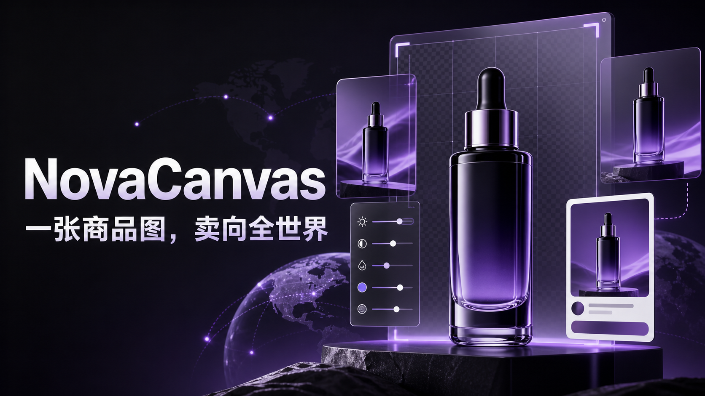
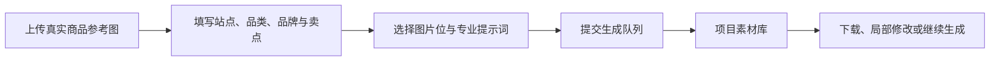
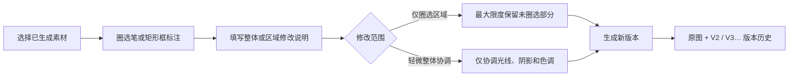
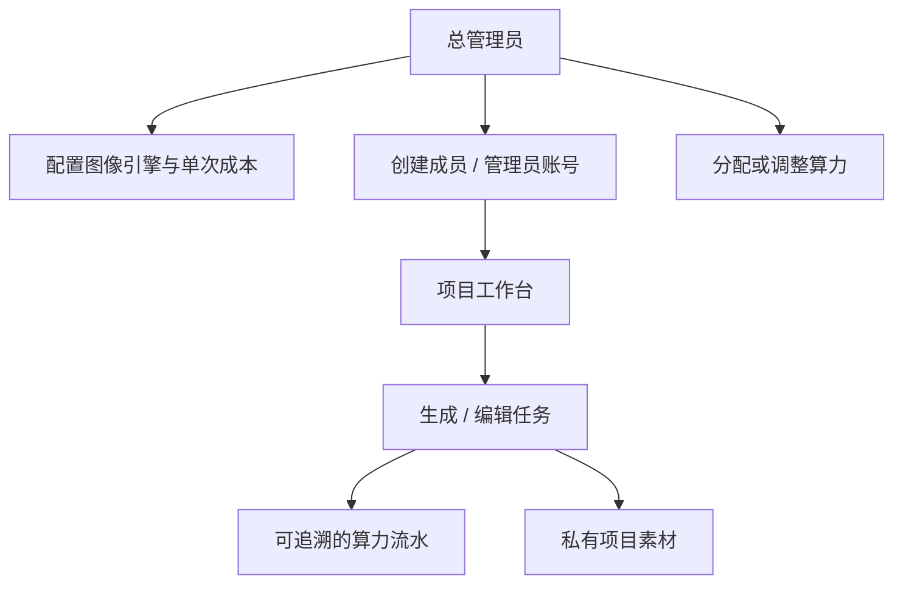

# NovaCanvas

> 一张真实商品参考图，协助运营团队持续产出可用于 Amazon Listing 的商品视觉素材。



NovaCanvas 是一个可自托管的 AI 商品图片工作台，面向 Amazon 跨境电商团队设计。它将商品资料、图片提示词、生成任务、局部修改、版本管理、素材下载和账号算力统一在同一个私有工作空间中。你可以接入自己已授权的图像生成服务，并将商品资料与素材保留在自己的服务器上。

> [!IMPORTANT]
> 本项目调用的图像模型、API 费用和生成结果由部署者自行负责。请仅上传拥有使用权的商品图、品牌素材和文案，并在发布前自行复核平台合规性。

## 为什么使用 NovaCanvas

| 真实业务痛点 | NovaCanvas 的处理方式 |
| --- | --- |
| 商品图、提示词和生成结果分散 | 以 Listing 项目为单位统一保存商品资料、套图和版本 |
| AI 容易改坏商品外观 | 生成与局部编辑时自动附加商品外观锁定和主图约束 |
| 一次生成不满意，只能重新来过 | 圈选需要修改的位置，保留原图并生成新的可追溯版本 |
| 团队共享 API Key 有风险 | API Key 仅保存在服务端；成员通过管理员分配的账号使用 |
| 大图加载影响素材浏览 | 原图保留，项目列表优先使用 WebP 缩略图 |

## 核心能力

### 1. 从商品资料到套图工作流



- 为 Amazon Listing 设计的 7 图故事板，可从主图、卖点、使用场景到包装清单逐张制作。
- 内置专业图片提示词库，覆盖 Listing、补充图、A+、营销活动、品类专用和视频分镜等场景。
- 支持 GPT Image 与 Gemini / Nano Banana 类接口，并可由总管理员在服务端配置或启停图像引擎。
- 同时执行最多 3 个图片任务；单个任务完成或失败不会阻塞其他素材继续提交。

### 2. 局部修改画布与版本历史



- 支持自由圈选和矩形框选，多处区域可分别填写修改要求。
- 每次编辑都会创建新版本，原图不会被覆盖；可下载、对比并继续基于任一版本修改。
- 编辑提示词会携带原始商品资料、生成要求和商品外观锁定规则。
- 针对 Amazon MAIN 主图可持续应用纯白背景、无额外文案/水印、不得虚构配件等约束。

### 3. 团队、权限与算力



- 账号由管理员创建和分配初始算力；成员不能在浏览器中看到第三方 API Key。
- 每次生成或编辑会预扣算力；接口失败时自动返还对应算力。
- 账号、项目、素材与下载接口均按用户权限校验；管理员可进行运营管理。

## 技术概览

| 模块 | 实现 |
| --- | --- |
| Web 应用 | Next.js、React、TypeScript |
| 数据库 | PostgreSQL、Drizzle ORM |
| 图片存储 | 私有本地存储；原图 + WebP 缩略图 |
| 图像服务 | OpenAI Images 兼容接口、Gemini 图像接口及可配置中转服务 |
| 部署 | Docker Compose 或宝塔 Node 项目 |

## 快速开始（Docker Compose）

### 前置条件

- Docker 与 Docker Compose
- 至少一种已授权的图像生成 API
- Node.js 22+（仅在本地开发或不使用 Docker 时需要）

### 1. 获取代码并创建本地配置

```bash
git clone https://github.com/your-account/NovaCanvas.git
cd NovaCanvas
cp .env.example .env
```

### 2. 编辑 `.env`

至少设置以下内容：

- `POSTGRES_PASSWORD` 和 `DATABASE_URL` 中一致的强密码
- `APP_URL`（生产环境填写实际 HTTPS 域名）
- `BOOTSTRAP_ADMIN_EMAIL`、`BOOTSTRAP_ADMIN_PASSWORD`、`BOOTSTRAP_ADMIN_NAME`
- `OPENAI_API_KEY` 或 `GEMINI_API_KEY` 中的至少一项

### 3. 启动

```bash
docker compose up -d --build
docker compose ps
```

应用默认仅监听本机 `127.0.0.1:3001`。生产环境请通过 Nginx、Caddy 或宝塔反向代理提供 HTTPS 访问。

更完整的中文操作步骤见 [部署教程.md](./部署教程.md)。

## 图像服务配置说明

NovaCanvas 不会把第三方密钥发送到普通用户浏览器。总管理员可以在运营后台维护服务端图像引擎配置，包括：

- 名称、服务商、Base URL 与模型名称
- API Key（仅服务端加密保存与使用）
- 单次生成/编辑成本、启停状态及编辑能力标记
- 保存时连通性测试

不同服务商对于尺寸、编辑能力和结果格式的支持有所不同。请以服务商的官方文档和实际测试为准，并在上线前为每个引擎完成一次生成与局部编辑验证。

## 安全与数据边界

- 不要提交 `.env`、数据库备份、素材目录或任何 API Key。
- `.env.example` 只包含安全的示例值；生产环境配置应仅保存在服务器上。
- 请为生产环境启用 HTTPS、强管理员密码和定期数据库备份。
- 图片生成服务可能产生不符合平台规则的结果；上线、投放或刊登前请进行人工审核。

## 开源协作

欢迎提交 Issue 和 Pull Request。建议提交前完成：

```bash
npm ci
npm run lint
npm run build
```

提交 PR 时请说明：问题背景、改动范围、测试方式，以及是否影响数据库结构、环境变量或已有部署。

## 许可证

本项目采用 [MIT License](./LICENSE)。你可以使用、复制、修改、分发和商用代码，但必须保留许可证与版权声明。

---

如果 NovaCanvas 对你的 Amazon 视觉生产流程有帮助，欢迎 Star、提出问题或分享改进建议。
